# 🔐 Fingerprint Spoof Detection using ConvNeXt Tiny

## 📌 Introduction

Fingerprint-based biometric systems are increasingly deployed in critical areas such as banking, mobile devices, and secure access systems. Their popularity stems from the uniqueness and permanence of fingerprints. However, these systems are not immune to attacks — especially **spoofing**, where adversaries present fake fingerprints to bypass authentication.

This project presents an **end-to-end system** for fingerprint spoof detection using the **ConvNeXt Tiny** deep learning model, a powerful yet lightweight CNN architecture. It combines solid model performance, a real-world dataset (LivDet2015), and a user-friendly **Streamlit GUI** to offer a practical and deployable solution.


## 🏛️ Context & Problem Statement

Biometric spoofing involves presenting artificial biometric samples (e.g., fake fingerprints) to deceive recognition systems. Attackers may use:

- 🧪 **Latex molds** capturing real fingerprints
- 🖨️ **Printed images** of fingerprints
- 🧬 **Synthetic fingerprints** generated using neural networks (GANs)
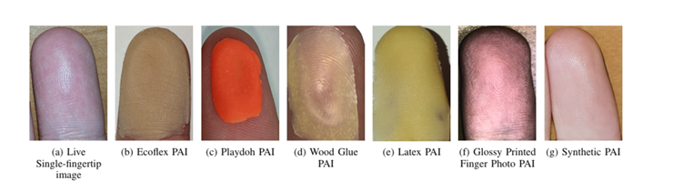

These attacks threaten the **integrity**, **privacy**, and **security** of systems in banking, law enforcement, healthcare, and border control. Thus, there's a growing need for **Presentation Attack Detection (PAD)** techniques that can robustly detect and reject such spoof attempts.


## 🎯 Objectives

- 🔍 Train a **binary classifier** to distinguish live from spoof fingerprints
- 📊 Evaluate using **intra-** and **cross-sensor** protocols on LivDet2015
- 💡 Ensure the model is **lightweight and efficient**, targeting embedded deployment
- 🧪 Explore **model generalization** to unseen sensors and spoofing materials
- 🖥️ Build a real-time **GUI with Streamlit** to facilitate non-technical usage


## 💡 Motivation

Most high-performance PAD models are too **computationally heavy** or **dataset-specific** for real-world deployment. This project explores how **modern lightweight CNNs** like **ConvNeXt Tiny** can bridge the gap between **accuracy** and **deployability**.


## 📚 Literature Review – PAD Techniques

| Approach         | Model / Method                   | Dataset             | Accuracy   | Pros                                      | Cons                                |
|------------------|----------------------------------|---------------------|------------|-------------------------------------------|-------------------------------------|
| AILearn [1]      | ResNet-50 + Texture Features     | LivDet 2011–2015    | 99.02%     | Robust to new fingerprints                | Poor generalization to new sensors |
| Thomas [2]       | CNN + LSTM                       | Proprietary         | 97.1%      | Captures spatio-temporal features         | Complex, slow inference             |
| Qureshi [3]      | Attention-based Multichannel CNN | LivDet, ATVS        | 97.78%     | Fine-grained focus on image regions       | Sensitive to hyperparameters        |
| Jamal [4]        | Multimodal (ECG + fingerprint)   | Mixed datasets      | 99.28%     | High robustness, multimodal fusion        | Requires extra hardware             |
| RFDforFin [8]    | Ridge Flow + FFT features        | PolyU-HRF           | 100%       | Lightweight, GAN-resistant                | Dataset-specific                    |
| Hybrid [5]       | CNN + SVM + Texture Descriptors  | ATVS, SOCOFing      | 99.6%      | Classic + deep feature fusion             | Not scalable to other domains       |
| MFAS [4]         | Behavioral biometrics (ECG)      | Captive             | 100%       | Gesture-based PAD                         | Very intrusive                      |
| **This Work**    | ConvNeXt Tiny (CNN)              | LivDet2015          | 94–98%     | Scalable, modern CNN, simple deployment   | Limited sensor generalization       |

> 📌 Most existing systems either lack generalization or are unsuitable for real-world embedded environments. This project addresses that gap.


## 🔄 Dataset: LivDet2015

The **LivDet2015** dataset is the gold standard for evaluating fingerprint spoof detection. It includes:

- 🧪 **5 sensors**:
  - CrossMatch
  - GreenBit
  - Hi_Scan
  - DigitalPersona
  - Biometrika (TimeSeries)

- 🎯 **Two classes**: Live / Fake
- 🧫 **Spoof materials**: latex, glue, playdoh, gelatin, ecoflex...
- 📈 **Evaluation strategies**:
  - **Intra-sensor**: train/test on same device
  - **Cross-sensor**: test on unseen sensor (real-world scenario)

### Dataset Visualizations
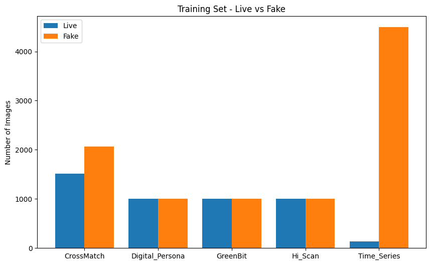  
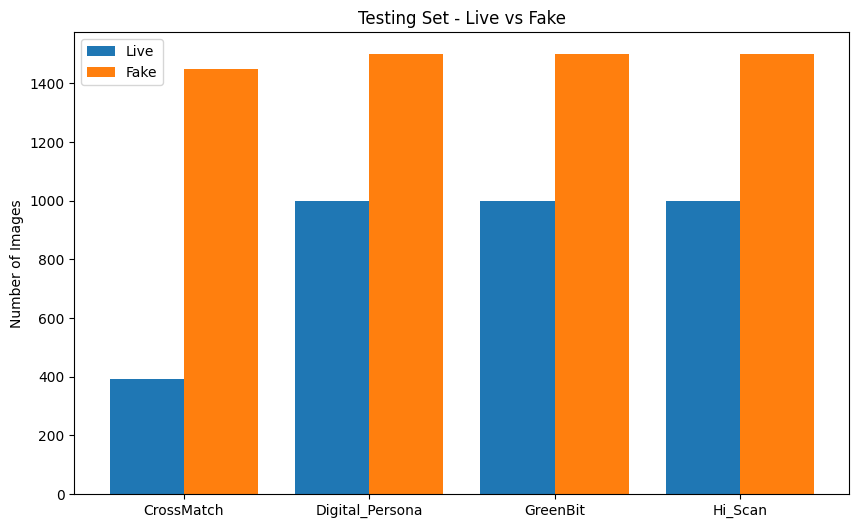  
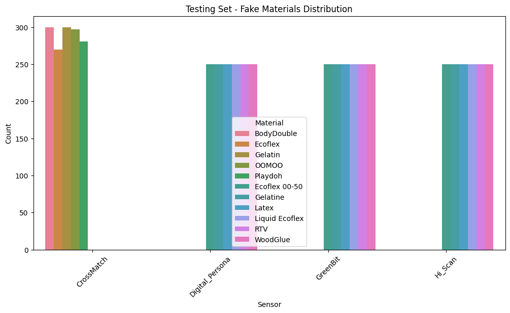


# 🤖 ConvNeXt Tiny - Anti-Spoofing Fingerprint Classification

## 📌 Overview

**ConvNeXt Tiny** is a next-generation **Convolutional Neural Network (CNN)** designed to combine the robustness of classical CNNs with the representational power and design principles of **Vision Transformers (ViTs)**. Introduced by Facebook AI in 2022, ConvNeXt achieves **Transformer-level accuracy** on image classification tasks while maintaining the **hardware efficiency** and **inductive bias** of CNNs.

In the context of **Presentation Attack Detection (PAD)** for fingerprint recognition, ConvNeXt Tiny is fine-tuned to perform **binary classification** — distinguishing between **Live** and **Spoofed** fingerprints. The model is particularly well-suited for this due to its ability to capture **fine-grained textural patterns** and **structural cues**, which are essential to detect subtle differences between genuine skin and spoofing materials like silicone or gelatin.


## ✅ Why ConvNeXt Tiny?

| Feature                        | Technical Description |
|-------------------------------|------------------------|
| 🧠 **Transformer-inspired**    | Utilizes LayerNorm, GELU, large kernel depthwise convolutions, and inverted bottleneck structures — all key elements from Transformer design |
| 🐣 **Compact & Lightweight**   | ~28.6M parameters with lower memory footprint, ideal for mobile or embedded biometric systems |
| ⚡ **High Accuracy**           | Outperforms traditional CNNs like ResNet-50 on various image classification benchmarks |
| 🧪 **Fine-tuning Friendly**    | Pre-trained on ImageNet and easy to adapt via transfer learning for downstream tasks like fingerprint anti-spoofing |
| 🔁 **Efficient Inference**     | Highly optimized for both GPU and CPU with parallelizable and hardware-friendly operations |


## 🏗️ Architecture Highlights

ConvNeXt Tiny rethinks every aspect of the CNN pipeline, applying modern techniques while remaining convolutional at its core.
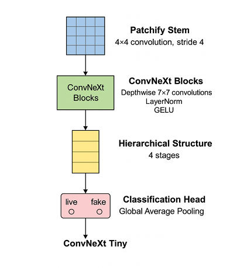


### 🔍 Detailed Architectural Breakdown

| Stage     | Patch / Stride | Output Channels | Blocks | Output Size (224×224 input) |
|-----------|----------------|------------------|--------|-----------------------------|
| **Stem**  | 4×4 / 4        | 96               | 1      | 56×56                       |
| **Stage 1** | 2×2 / 2      | 192              | 3      | 28×28                       |
| **Stage 2** | 2×2 / 2      | 384              | 9      | 14×14                       |
| **Stage 3** | 2×2 / 2      | 768              | 3      | 7×7                         |
| **Head**  | GAP + Linear   | 1 (Sigmoid)      | -      | 1×1                         |

### 🧩 Key Components

#### 1. **Patchify Stem**
- Applies a `Conv2D(4×4, stride=4)` to convert the image into 96-dimensional token-like embeddings.
- Mimics the "patch embedding" mechanism in ViTs but using convolution.

#### 2. **Depthwise Separable Convolutions (7×7)**
- Applies large spatial convolutions in a depthwise manner, which:
  - Increases the receptive field.
  - Preserves spatial detail and texture — key for spoof detection.
  - Greatly reduces computational complexity.

#### 3. **Layer Normalization (instead of BatchNorm)**
- More robust during fine-tuning, especially on small batch sizes or non-stationary data.
- Applied **before** convolutions (pre-norm) to stabilize gradients.

#### 4. **Inverted Bottleneck Block**
- Similar to MobileNetV2:
  - Expand → Nonlinearity → Depthwise Conv → Project → Residual.
- Encourages efficient feature transformation and dimensionality control.

#### 5. **GELU Activation**
- Smooth, non-linear activation that improves convergence and representational capacity over ReLU.
- Defined as:  
  \[
  \text{GELU}(x) = x \cdot \Phi(x)
  \]
  where \(\Phi(x)\) is the standard Gaussian cumulative distribution function.

#### 6. **Global Average Pooling (GAP) + Fully Connected Layer**
- Reduces the 7×7×768 output to a 768-dimensional vector.
- Followed by a dense layer and sigmoid activation for binary classification (Live vs Spoof).


## 🔐 Relevance to Anti-Spoofing

ConvNeXt Tiny is highly effective for fingerprint spoof detection because:

- 🧬 **Spoofing relies on subtle texture deformations**, which the model can learn via large-kernel depthwise convolutions.
- 🔍 **Captures both local details (ridge/valley patterns)** and **global structure (finger shape)**.
- 🧠 **Transformer-like components enable better generalization** across spoofing materials and acquisition devices.
- 💡 **Architecture is modular**, allowing potential fusion with temporal or multispectral modalities for multimodal PAD systems.


## ⚙️ Model Summary

ConvNeXt Tiny:
- Parameters: ~28.6M
- FLOPs: ~4.5 GFLOPs
- Layers: 50+
- Input Size: 224×224
- Output: Sigmoid-activated single neuron (Live/Spoof)


## ⚙️ Training Setup

- **Loss Function**: Binary Cross-Entropy Loss
- **Optimizer**: AdamW
- **Scheduler**: Cosine Annealing
- **Augmentations**:
  - Flip (H/V)
  - Rotation, Zoom
  - Brightness, Contrast
- **Regularization**: Dropout + Early Stopping + Weight Decay
- **Validation Strategy**: Stratified cross-validation


## 📈 Performance Summary

### 📊 Intra-sensor Results

| Sensor         | Accuracy | Precision | Recall | F1 Score |
|----------------|----------|-----------|--------|----------|
| Hi_Scan        | 94.08%   | 0.96      | 0.94   | 0.95     |
| CrossMatch     | 98.00%   | 1.00      | 0.97   | 0.99     |
| DigitalPersona | 89.00%   | 0.92      | 0.89   | 0.90     |

### 🔁 Cross-sensor Results (trained on CrossMatch)

| Test Sensor | Accuracy | F1 Score |
|-------------|----------|----------|
| GreenBit    | 60.44%   | 0.61     |
| Hi_Scan     | 64.88%   | 0.67     |
| D. Persona  | 69.36%   | 0.70     |

> 🔍 Drop in cross-sensor accuracy highlights a **generalization gap**, motivating future work on **domain adaptation** and **sensor-invariant features**.


### 📊 Visual Results

- ROC Curves  
  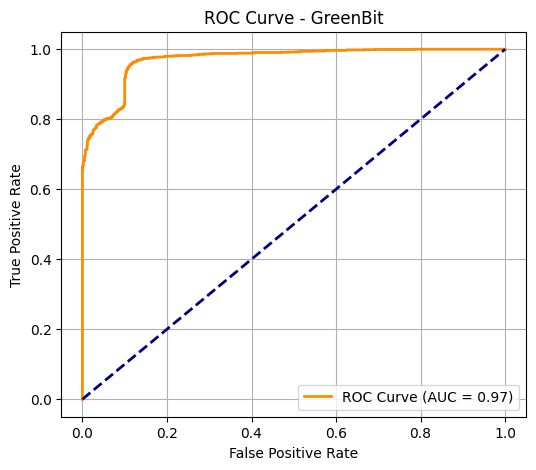

- PR Curve  
  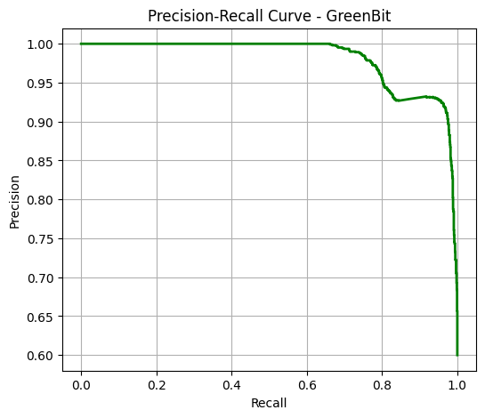

- Validation Accuracy  
  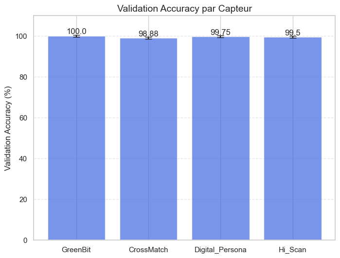

- Sensor-wise Comparison  
  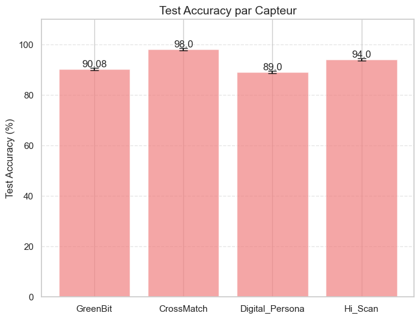  
  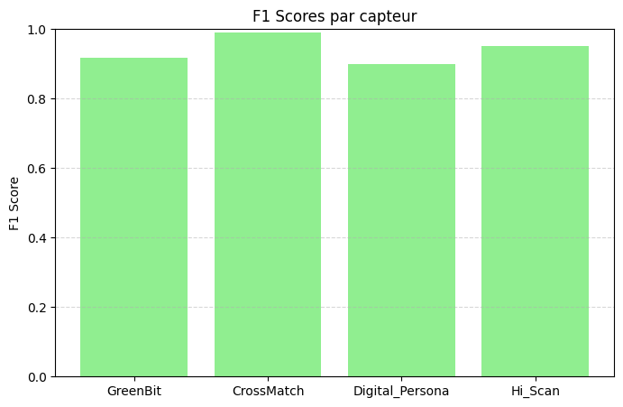  
  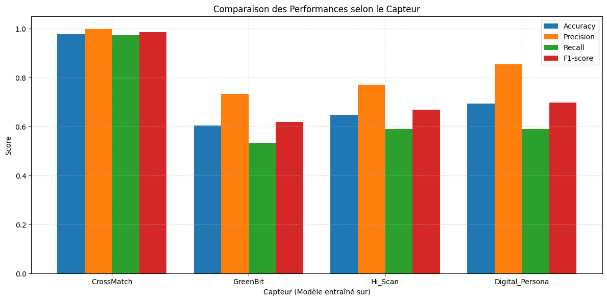


### 🔍 Confusion Matrices

| GreenBit |  
|----------|  
| 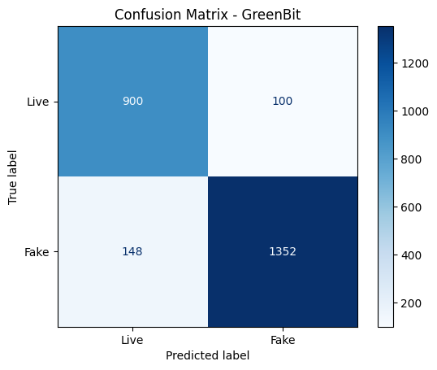 |

| DigitalPersona |  
|----------------|  
| 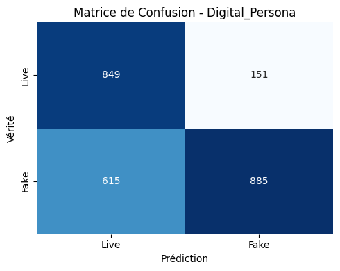 |

| Hi_Scan |  
|---------|  
| 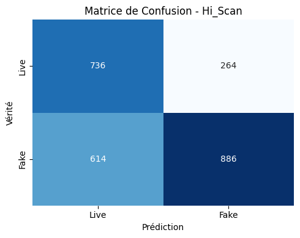 |

| CrossMatch |  
|------------|  
| 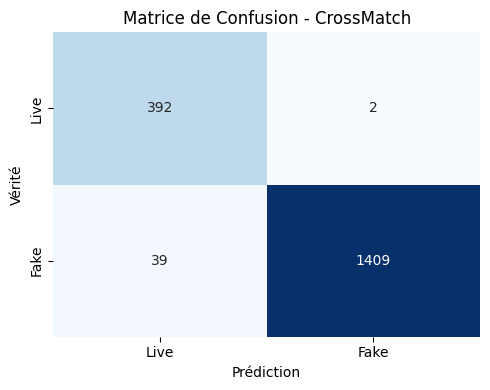 |

---

## 🌐 Streamlit Interface

A minimal GUI has been implemented using **Streamlit**, allowing:

- 📁 Image Upload
- 🔄 Preprocessing (resizing, grayscale)
- 🧠 Prediction (Live/Fake)
- 📊 Confidence score display

### Run the App
```bash
streamlit run app.py
```

## ⚙️ Installation & Environment

### Required Libraries
You can install the dependencies using:
```bash
pip install -r requirements.txt
```

### Recommended Setup (optional)
```bash
python -m venv venv
source venv/bin/activate  # On Windows: venv\Scripts\activate
pip install -r requirements.txt
```

If `requirements.txt` is missing, here are the main libraries:
```txt
torch
torchvision
timm
streamlit
scikit-learn
matplotlib
pillow
tqdm
```

## 🌟 Future Work

🔁 Improve cross-sensor generalization via domain adaptation

🧠 Add attention mechanisms or contrastive learning

🎨 Integrate explainability tools like SHAP or Grad-CAM in GUI

📲 Deploy model on mobile/edge devices (TinyML)

⏳ Implement continual learning pipelines

🔐 Extend to multimodal PAD (e.g., ECG + Fingerprint)


## 👤 Author

**Khaoula Boughattas**  
Data Engineering and Decision Systems Student – ENET'COM  
Final Year Project – April 2025  
Supervisor: Mrs. Sonda Ammar  

- [LinkedIn](https://www.linkedin.com/in/khaoula-boughattas-983597295/)  
- [Email](mailto:boughattaskhawla@gmail.com)

---

## 🌍 Useful Links

- [LivDet 2015 Dataset](https://livdet.org)
- [ConvNeXt Paper](https://arxiv.org/abs/2201.03545)
- [Streamlit Documentation](https://docs.streamlit.io)
- [PyTorch](https://pytorch.org)
- [ConvNeXt: A ConvNet for the 2020s (Facebook AI)](https://arxiv.org/abs/2201.03545)
- [Deep Learning for Fingerprint Spoof Detection](https://arxiv.org/abs/1701.07417)
- [TorchVision ConvNeXt Docs](https://pytorch.org/vision/stable/models/generated/torchvision.models.convnext_tiny.html)

---

## 📜 License

This repository is for **educational and research purposes only**, developed during the **Final Year Project 2025**.  
For collaboration, reuse, or partnership opportunities, please contact the author.

> This project demonstrates the potential of deep learning to strengthen biometric systems against modern spoofing attacks.
