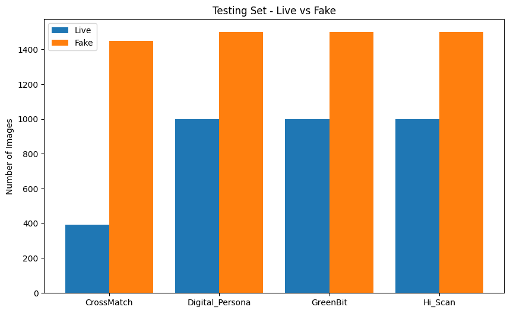
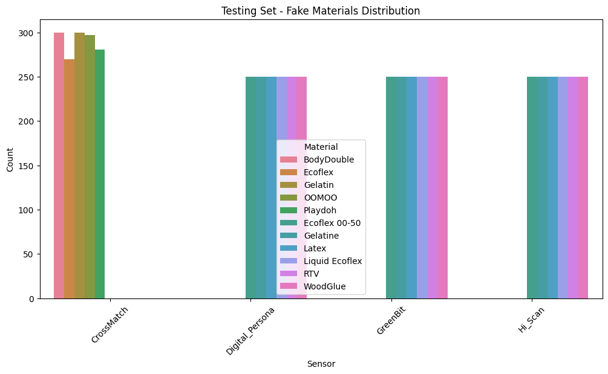

#  Fingerprint Spoof Detection using ConvNeXt Tiny

## Project Overview

This project aims to build a reliable fingerprint spoof detection system by combining **deep learning models**, **real-world biometric datasets**, and an intuitive **graphical user interface**. 

It responds to the growing need for strong anti-spoofing solutions as fake fingerprints become more common in biometric attacks. By training on diverse data and offering a user-friendly interface, the system ensures accurate and practical spoof detection for real-world security applications.

---
## 🏛️ Context & Problem Statement

Fingerprint recognition is one of the most widely adopted biometric modalities due to its **ease of acquisition**, **reliability**, and **uniqueness**. These advantages have made it a preferred choice in various security applications such as mobile authentication, border control, and access management.

However, despite its popularity, fingerprint recognition systems remain vulnerable to **presentation attacks** (spoofing), where attackers attempt to fool the system using artificial fingerprints. These fake fingerprints can be created through various methods, including:

- **Physical spoofs**: Using materials like latex, gelatin, silicone to create molds.
- **Printed spoofs**: High-definition fingerprint images printed on paper.
- **Digital spoofs**: Synthetic fingerprints generated by advanced techniques such as Generative Adversarial Networks (GANs).

Such attacks pose serious threats to the security and trustworthiness of biometric systems. Therefore, the central challenge lies in designing an **automatic and accurate method** to **distinguish between live (genuine) and fake (spoof) fingerprints**, ensuring robustness across different sensors and spoof types.

---

## 🎯 Project Objectives

- Develop and implement a **binary classifier** capable of distinguishing *live* fingerprints from *fake* ones.
- Train and evaluate models on the widely recognized **LivDet2015** dataset, benchmarking against existing solutions.
- Build a **simple and user-friendly graphical interface** to allow real-time inference and ease of use.
- Investigate and analyze the **limitations related to inter-sensor generalization**, i.e., how well the model performs on data from sensors it was not trained on.

---

## 🔍 State of the Art – PAD Model Comparison

The following table summarizes recent prominent approaches in fingerprint Presentation Attack Detection (PAD), highlighting their models, datasets, accuracy, strengths, and limitations.

| Approach         | Model / Method                    | Dataset             | Accuracy    | Strengths                      | Limitations                  |
|------------------|---------------------------------|---------------------|-------------|-------------------------------|------------------------------|
| AILearn [1]      | ResNet-50 + LBP, LPQ, BSIF       | LivDet2011–2015     | 99.02%      | Incremental learning, robust to new fingerprints | Performance drop on unknown sensors (KF) |
| Thomas [2]       | CNN + LSTM                      | Proprietary          | 97.1%       | Exploits spatio-temporal features | High computational requirements |
| Qureshi [3]      | ResNet + Attention Multichannel | LivDet, ATVS         | 97.78%      | Multi-channel attention mechanism | Sensitive to hyperparameters |
| Jamal [4]        | ECG + Fingerprint Fusion         | Multiple datasets    | 99.28%      | Multimodal approach, suitable for IoT | Hardware cost, privacy concerns |
| RFDforFin [8]    | FFT + Ridge Streams              | PolyU-HRF            | 100% / 99.5%| Lightweight, resistant to GAN attacks | Dataset-specific, limited generalization |
| Hybrid [5]       | CNN + SVM + Texture Descriptors  | ATVS-FFp-DB, SOCOFing| 99.6%       | Combines texture and deep learning | Performance varies by dataset |
| MFAS [4]         | Behavioral Analysis (ECG)        | Captive datasets     | 100%        | Forced gesture detection, high accuracy | Intrusive and costly hardware |
| ConvNeXt (this work) | Pure CNN                      | LivDet2015           | ~94-98%     | Lightweight, scalable          | Poor inter-sensor generalization |

---

Cette comparaison met en évidence les avancées dans le domaine, tout en soulignant les défis persistants, notamment la **généralisation aux capteurs inconnus** et la **robustesse face à des attaques variées**. Ce projet se positionne dans cette dynamique pour proposer une solution performante et accessible.

---

*Références :*

1. AILearn - Incremental learning with ResNet-50 and texture descriptors  
2. Thomas et al. - Spatio-temporal CNN+LSTM  
3. Qureshi et al. - Attention multichannel ResNet  
4. Jamal et al. - Multimodal ECG and fingerprint fusion  
5. Hybrid approach combining CNN + SVM + LBP  
8. RFDforFin - FFT and Ridge flow features

---


## 🔄 Dataset: LivDet2015

- 📋 **5 sensors**: CrossMatch, GreenBit, Hi_Scan, DigitalPersona, TimeSeries
- 🔍 **Classes**: Live / Fake
- 🧪 **Spoofing Materials**: latex, gelatin, glue, playdoh, ecoflex...
- ✔️ **Evaluation**: Intra-sensor and Cross-sensor (robustness)

📊 **Dataset Distribution:**






*Figure 1 : Distribution des images du dataset LivDet2015, selon les catégories Live vs Fake et par capteurs.*


---

## 🤖 Model: ConvNeXt Tiny

ConvNeXt is a modern CNN architecture inspired by Transformer design, optimized for image classification.

### Advantages
- Competitive with ResNet & ViT
- Fewer parameters (Tiny version)
- Ideal for fine-tuning on small datasets

### Architecture
- 7x7 depthwise convolutions
- LayerNorm normalization
- GELU activation
- Binary classification head (Live / Fake)

---

## 📊 Results

### Intra-sensor
| Sensor | Accuracy | Precision | Recall | F1 Score |
|--------|----------|-----------|--------|----------|
| Hi_Scan | 94.08%   | 0.96      | 0.94   | 0.95     |
| CrossMatch | 98.00% | 1.00      | 0.97   | 0.99     |
| DigitalPersona | 89.00% | 0.92 | 0.89 | 0.90     |

### Cross-sensor (trained on CrossMatch)
| Tested on | Accuracy | F1 Score |
|-----------|----------|----------|
| GreenBit  | 60.44%   | 0.61     |
| Hi_Scan   | 64.88%   | 0.67     |
| D. Persona | 69.36%  | 0.70     |

📈 **Validation Accuracy vs Epochs:**


📉 **Performance Comparison by Sensor:**


### 🧮 Confusion Matrices

| CrossMatch | GreenBit |
|------------|----------|
|  |  |

| Hi_Scan | DigitalPersona |
|--------|-----------------|
|  |  |

📌 **Analysis:**
- Strong accuracy on sensor used for training
- Significant performance drop on unseen sensors

---

## 🌐 Graphical Interface (Streamlit)

The Streamlit-based interface allows:
- 📷 Uploading fingerprint images
- ✅ Automatic preprocessing (resize, normalization)
- 🔍 Prediction of Live or Fake
- 📊 Real-time confidence score

### Launching the App
```bash
streamlit run app.py
```

---

## ⚙️ Installation & Environment

### Required Libraries
You can install the dependencies using:
```bash
pip install -r requirements.txt
```

### Recommended Setup (optional)
```bash
python -m venv venv
source venv/bin/activate  # On Windows: venv\Scripts\activate
pip install -r requirements.txt
```

If `requirements.txt` is missing, here are the main libraries:
```txt
torch
torchvision
timm
streamlit
scikit-learn
matplotlib
pillow
tqdm
```

---

## 🌟 Future Work

- 📈 Improve cross-sensor generalization (domain adaptation)
- 🧪 Use GANs for data augmentation
- 📱 Deploy on mobile devices (TinyML)
- 🧠 Enable online & continual learning

---

## 👤 Author

**Khaoula Boughattas**  
ENET'Com - University of Sfax  
Final Year Project – April 2025  
Supervisor: Mrs. Sonda Ammar  

---

## 🌍 Useful Links

- [LivDet 2015 Dataset](https://livdet.org)
- [ConvNeXt Paper](https://arxiv.org/abs/2201.03545)
- [Streamlit Documentation](https://docs.streamlit.io)
- [PyTorch](https://pytorch.org)

---

> This project demonstrates the potential of deep learning to strengthen biometric systems against modern spoofing attacks.
